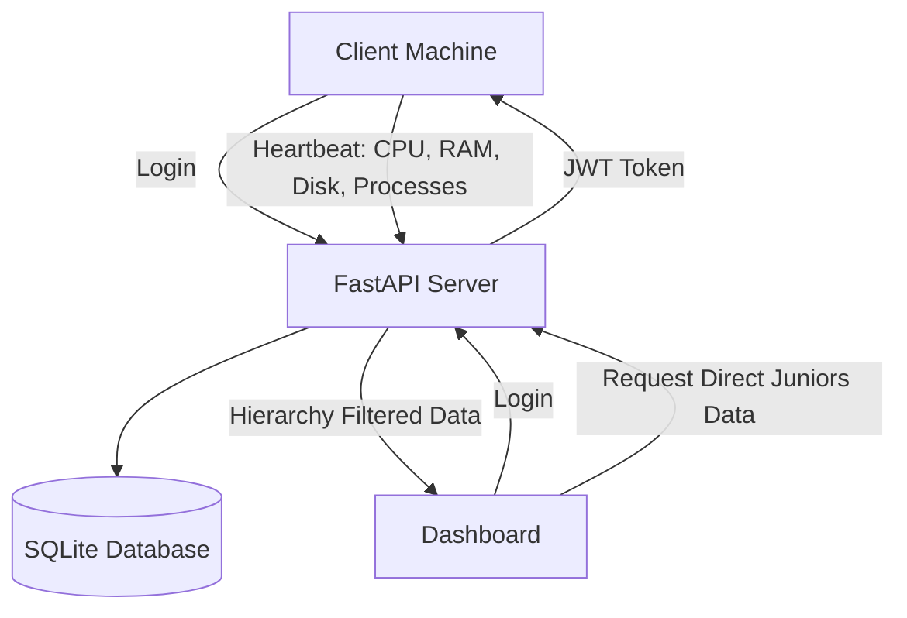

# SentinelHub

**SentinelHub** is a Python-based distributed system monitoring platform for organization and LAN environments.
Client machines send system information such as CPU usage, memory usage, disk usage, running processes, hostname, IP address, and MAC address to a central **FastAPI server**.

The enhanced version adds **hierarchy-based monitoring**, where a senior can monitor only their directly assigned juniors.

---

## Key Enhancement: Hierarchy-Based Monitoring

Earlier, monitoring was mostly manager-based. Now the system supports organization-level post hierarchy.

Example:

```text
Hierarchy Admin
   ├── Senior Engineer A
   │      ├── Junior Engineer 1
   │      └── Junior Engineer 2
   │
   └── Senior Engineer B
          ├── Junior Engineer 3
          └── Junior Engineer 4
```

Monitoring rule:

```text
A user can monitor another user only if:
1. The target user directly reports to the logged-in user.
2. The logged-in user has a higher post level.
3. The logged-in user's post has monitoring permission.
```

So:

| Logged-in User    | Can Monitor                          |
| ----------------- | ------------------------------------ |
| Hierarchy Admin   | Senior Engineer A, Senior Engineer B |
| Senior Engineer A | Junior Engineer 1, Junior Engineer 2 |
| Senior Engineer B | Junior Engineer 3, Junior Engineer 4 |
| Junior Engineers  | Nobody                               |

---

## System Flow



---

## Project Structure

```text
SentinelHub/
│
├── server/
│   ├── core/              # Config, security, dependencies
│   ├── db/                # Database connection and models
│   ├── routes/            # API routes
│   ├── schemas/           # Request/response schemas
│   ├── services/          # Business logic
│   ├── scripts/           # Seed scripts
│   └── main.py            # FastAPI entry point
│
├── client/
│   ├── client.py          # Sends heartbeat data
│   ├── monitor.py         # Collects system stats
│   └── viewer.py          # Optional CLI viewer
│
├── dashboard/
│   └── app.py             # Streamlit dashboard
│
├── requirements.txt
└── README.md
```

---

## Tech Stack

| Component         | Technology |
| ----------------- | ---------- |
| Backend           | FastAPI    |
| Database          | SQLite     |
| ORM               | SQLAlchemy |
| Authentication    | JWT        |
| Password Hashing  | bcrypt     |
| Dashboard         | Streamlit  |
| Client Monitoring | psutil     |
| Data Handling     | pandas     |

---

## Main Features

* User registration and login
* JWT-protected APIs
* bcrypt password hashing
* Client heartbeat monitoring
* CPU, memory, disk, and process tracking
* Machine information storage
* Alert/error logging
* Streamlit dashboard
* Post-level hierarchy system
* Direct junior monitoring
* Secure hierarchy management endpoints

---

## Database Hierarchy Design

New hierarchy support is mainly based on two concepts:

### 1. Post Table

Each post has a level and permission flags.

Example posts:

| Post            | Level | Can Monitor | Can Manage Hierarchy |
| --------------- | ----: | ----------: | -------------------: |
| Junior Engineer |     1 |           0 |                    0 |
| Senior Engineer |     2 |           1 |                    0 |
| Team Lead       |     3 |           1 |                    0 |
| Manager         |     4 |           1 |                    0 |
| Hierarchy Admin |     5 |           1 |                    1 |

### 2. User Reporting Mapping

Each user has:

```text
post_id
reporting_officer_id
```

Example:

```text
Junior Engineer 1 reports to Senior Engineer A
```

Database mapping:

```text
Junior Engineer 1 reporting_officer_id = Senior Engineer A employee_id
```

---

## Important API Endpoints

### Authentication

| Method | Endpoint             | Purpose                 |
| ------ | -------------------- | ----------------------- |
| POST   | `/api/auth/register` | Register user           |
| POST   | `/api/auth/login`    | Login and get JWT token |

### Hierarchy Management

These require a user with `can_manage_hierarchy = 1`.

| Method | Endpoint                             | Purpose                  |
| ------ | ------------------------------------ | ------------------------ |
| POST   | `/api/auth/posts`                    | Create post              |
| PUT    | `/api/auth/update-post`              | Assign/update user post  |
| PUT    | `/api/auth/assign-reporting-officer` | Assign reporting officer |

### Monitoring

| Method | Endpoint              | Purpose                          |
| ------ | --------------------- | -------------------------------- |
| POST   | `/api/node/heartbeat` | Send client heartbeat            |
| GET    | `/api/node/juniors`   | View direct juniors              |
| GET    | `/api/node/summary`   | View direct juniors summary      |
| GET    | `/api/node/logs`      | View direct juniors process logs |
| GET    | `/api/node/metrics`   | View direct juniors metrics      |
| GET    | `/api/node/errors`    | View direct juniors alerts       |

---

## Installation

### 1. Clone the repository

```bash
git clone <repository-url>
cd SentinelHub
```

### 2. Create virtual environment

```bash
python -m venv venv
```

Activate on Windows:

```bash
venv\Scripts\activate
```

### 3. Install dependencies

```bash
python -m pip install -r requirements.txt
```

If needed:

```bash
python -m pip install psutil pandas streamlit streamlit-autorefresh python-dotenv
```

---

## Environment Setup

Create `.env` inside `server/`:

```env
SECRET_KEY=change-this-secret-key
ACCESS_TOKEN_EXPIRE_MINUTES=60
```

Create `.env` inside `dashboard/`:

```env
SERVER_URL=http://127.0.0.1:8000
```

---

## Running the Server

```bash
cd server
uvicorn main:app --reload --host 127.0.0.1 --port 8000
```

Open Swagger UI:

```text
http://127.0.0.1:8000/docs
```

---

## Seed Default Posts

Run this from the `server/` folder:

```bash
python scripts/seed_posts.py
```

This creates:

```text
Junior Engineer
Senior Engineer
Team Lead
Manager
Hierarchy Admin
```

---

## Quick Testing Guide

Use Swagger:

```text
http://127.0.0.1:8000/docs
```

### 1. Register Hierarchy Admin

```json
{
  "name": "Admin User",
  "employee_id": 100,
  "password": "AdminPass1!",
  "designation": "Hierarchy Admin",
  "post_id": 5,
  "reporting_officer_id": null
}
```

### 2. Register Senior Engineer A

```json
{
  "name": "Senior Engineer A",
  "employee_id": 101,
  "password": "SeniorA1!",
  "designation": "Senior Engineer",
  "post_id": 2,
  "reporting_officer_id": 100
}
```

### 3. Register Senior Engineer B

```json
{
  "name": "Senior Engineer B",
  "employee_id": 102,
  "password": "SeniorB1!",
  "designation": "Senior Engineer",
  "post_id": 2,
  "reporting_officer_id": 100
}
```

### 4. Register Junior Engineer 1 under Senior A

```json
{
  "name": "Junior Engineer 1",
  "employee_id": 201,
  "password": "Junior1!",
  "designation": "Junior Engineer",
  "post_id": 1,
  "reporting_officer_id": 101
}
```

### 5. Register Junior Engineer 2 under Senior A

```json
{
  "name": "Junior Engineer 2",
  "employee_id": 202,
  "password": "Junior2!",
  "designation": "Junior Engineer",
  "post_id": 1,
  "reporting_officer_id": 101
}
```

### 6. Register Junior Engineer 3 under Senior B

```json
{
  "name": "Junior Engineer 3",
  "employee_id": 203,
  "password": "Junior3!",
  "designation": "Junior Engineer",
  "post_id": 1,
  "reporting_officer_id": 102
}
```

---

## Testing Monitoring Access

### Login as Senior Engineer A

```json
{
  "employee_id": 101,
  "password": "SeniorA1!"
}
```

Authorize Swagger using:

```text
Bearer <access_token>
```

Call:

```text
GET /api/node/juniors
```

Expected result:

```text
Senior Engineer A should see only:
- Junior Engineer 1
- Junior Engineer 2
```

Senior Engineer A should not see Junior Engineer 3.

---

## Testing Heartbeat

Login as Junior Engineer 1 and authorize with Junior 1 token.

Call:

```text
POST /api/node/heartbeat
```

Payload:

```json
{
  "mac_address": "AA:BB:CC:DD:EE:201",
  "hostname": "junior-1-pc",
  "ip_address": "192.168.1.201",
  "processes": ["python", "chrome", "vscode"],
  "cpu_percent": 45,
  "memory_percent": 60,
  "disk_percent": 70
}
```

Now login as Senior Engineer A and call:

```text
GET /api/node/logs
GET /api/node/metrics
```

Senior Engineer A should see only Junior Engineer 1 and Junior Engineer 2 data.

---

## Running the Dashboard

Open another terminal:

```bash
cd dashboard
streamlit run app.py
```

Dashboard opens at:

```text
http://localhost:8501
```

Login as:

```text
Employee ID: 101
Password: SeniorA1!
```

Expected dashboard result:

```text
Direct Juniors:
- Junior Engineer 1
- Junior Engineer 2
```

Logs and metrics should show only the data of juniors under Senior Engineer A.

---

## Security Improvements Added

* Management endpoints are protected by JWT.
* Only users with `can_manage_hierarchy = 1` can manage posts and reporting officers.
* Dashboard does not pass `manager_id` manually.
* Backend identifies logged-in user from JWT.
* Users can monitor only direct juniors.
* Changing URL employee IDs cannot expose other users' data.

---

## Contribution Summary

This enhancement upgrades SentinelHub from simple manager-based monitoring to proper hierarchy-based organization monitoring.

Main contribution:

```text
Added post-level hierarchy monitoring with direct junior access control.
```

Implemented:

* `Post` model
* `post_id` in users
* hierarchy permission flags
* direct junior filtering
* hierarchy management APIs
* updated dashboard APIs
* seed script for posts
* safe testing workflow

---

## Future Improvements

* Add Alembic migrations
* Add PostgreSQL support
* Add Docker setup
* Add real-time WebSocket dashboard
* Add audit logs for hierarchy changes
* Add CSV/PDF report export
* Add better client process monitoring
* Add unit and integration tests

---

## Final Note

SentinelHub now ensures:

```text
Senior Engineer A can monitor only juniors under Senior Engineer A.
Senior Engineer B can monitor only juniors under Senior Engineer B.
Hierarchy Admin can monitor only direct seniors.
Junior users cannot monitor anyone.
```

This makes the project more suitable for real organization-based monitoring systems.
